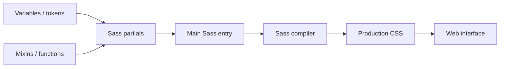
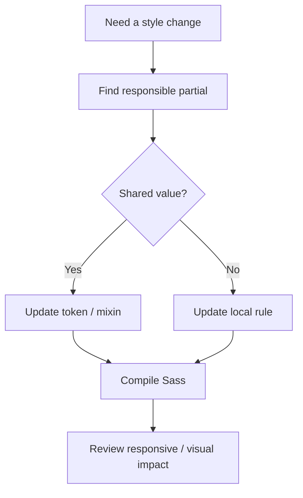
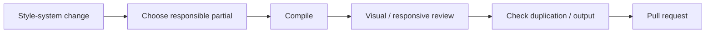

<div align="center">

# Sass Boilerplate

**A Sass/SCSS starter repository for organizing reusable styles, variables, mixins, partials, and maintainable front-end CSS architecture.**


[Browse source](https://github.com/Nischhalsubba/sassBoilerplate/tree/master) · [Issues](https://github.com/Nischhalsubba/sassBoilerplate/issues)

</div>

## Overview

**Sass Boilerplate** is a reusable styling foundation. Its value is not the number of folders it can accumulate, but whether styles have clear ownership, shared tokens stay consistent, and compiled CSS remains understandable and easy to change.

<details open>
<summary><strong>🏗️ Interactive Sass architecture</strong></summary>



</details>

## Styling flow



## Audience guide

| Audience | Focus |
|---|---|
| Developers | Structure, imports, compile path and output |
| Designers | Tokens, typography, spacing, color and responsive rules |
| Maintainers | Avoid duplication, dead partials and uncontrolled specificity |

## Getting started

```bash
git clone https://github.com/Nischhalsubba/sassBoilerplate.git
cd sassBoilerplate
```

Use the build tooling declared by the repository. If a package manifest and lockfile are present, use the matching package manager rather than introducing a second one casually, as humans somehow keep doing.

## Style-system principles

Prefer tokens for shared decisions, keep component/page rules close to their responsibility, avoid deep nesting, document unusual mixins/functions, and remove unused architecture instead of preserving empty folders for ceremonial purposes.

## Discoverability

Use accurate terms such as **Sass boilerplate, SCSS starter, Sass architecture, CSS architecture, Sass variables, mixins, partials, and front-end styling** in repository descriptions and documentation.

## Contribution flow


