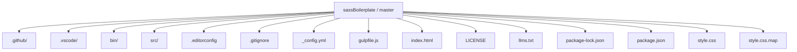
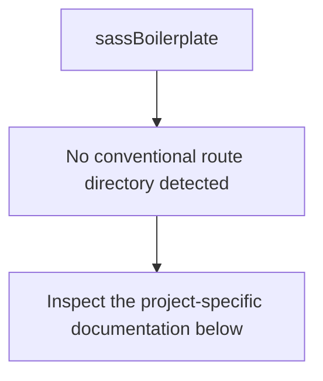
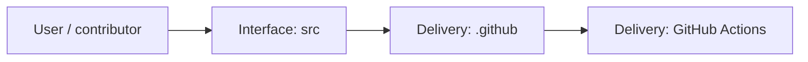
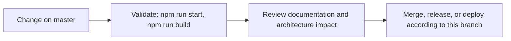

# sassBoilerplate

<!-- interactive-readme-standard:start -->

> [!NOTE]
> **Branch-specific documentation:** this section is maintained for [`master`](https://github.com/Nischhalsubba/sassBoilerplate/tree/master). It is generated from the files present on this branch and preserves the project-authored README below.

<details open>
<summary><strong>Interactive repository guide</strong></summary>

## Branch overview

| Item | Value |
|---|---|
| Repository | [`Nischhalsubba/sassBoilerplate`](https://github.com/Nischhalsubba/sassBoilerplate) |
| Branch | [`master`](https://github.com/Nischhalsubba/sassBoilerplate/tree/master) |
| Detected stack | JavaScript, HTML, CSS |
| Detected manifests | package.json |
| Documentation policy | Every maintained branch must explain purpose, setup, structure, architecture, flows, testing, delivery, security, and ownership. |

## Repository structure



The diagram is generated from the branch's actual top-level files and directories. Use the branch link above for complete source navigation.

## Website or application structure



## Application and responsibility flow



## Change-to-delivery flow



## README requirements for this branch

- Explain what this branch contains and how it differs from the default branch.
- Keep installation, configuration, usage, testing, deployment, security, support, and license information accurate.
- Document repository, website or application, API, data, authentication, background-job, and deployment flows when they exist.
- Prefer Mermaid diagrams and expandable `<details>` sections for visual navigation.
- Link diagrams and modules to real source paths; never invent missing components.
- Preserve project-specific documentation and update diagrams whenever architecture or major paths change.
- Treat secrets, private infrastructure, customer data, and credentials as prohibited README content.

</details>

<!-- interactive-readme-standard:end -->

A historical copy of the **JR Cologne Gulp Starter Kit** used for learning and experimenting with Sass, Pug, Babel, BrowserSync, image optimization, and Gulp 4 workflows.

## Important status

This repository is not the canonical source of the starter kit and should not be presented as an independently maintained npm package.

The package metadata identifies the upstream project as:

- Package: `@jr-cologne/create-gulp-starter-kit`
- Original author: JR Cologne
- Original repository: https://github.com/jr-cologne/gulp-starter-kit
- License: MIT

Use the original project and its current documentation when you need authoritative installation, issue tracking, releases, or licensing information.

## What the archived workflow includes

- Gulp 4 task automation
- Sass, SCSS, Less, and Stylus compilation
- Pug template compilation
- Babel-based JavaScript transpilation
- JavaScript concatenation and minification
- BrowserSync development server
- CSS autoprefixing and minification
- image optimization
- sourcemaps
- dependency and asset copying

## Historical requirements

The package declares Node.js 10 or newer, but several dependencies and build assumptions are now old. Modern Node.js versions may expose incompatibilities, especially around:

- `gulp-sass` 4 and its native Sass implementation
- older image-minification packages
- deprecated dependency versions
- older Babel and webpack-stream behavior

Do not assume the project builds on a current runtime without testing and dependency migration.

## Run the archived version

```bash
npm install
npm start
```

Build without the development server:

```bash
npm run build
```

These commands describe the historical package scripts, not a guarantee of compatibility with modern Node.js.

## Recommended modern direction

For new static projects, consider:

- Dart Sass instead of deprecated native Sass bindings
- Vite or another supported build tool
- PostCSS and Autoprefixer
- native ES modules
- modern image pipelines
- explicit linting and formatting

## Repository purpose

This copy is retained as a learning archive showing an earlier static-site automation workflow. It should not be published to npm under the upstream package name or used to report issues to the original project without first reproducing them against the canonical repository.
