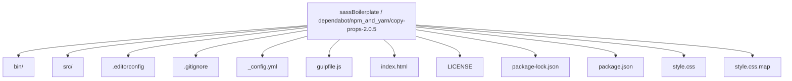
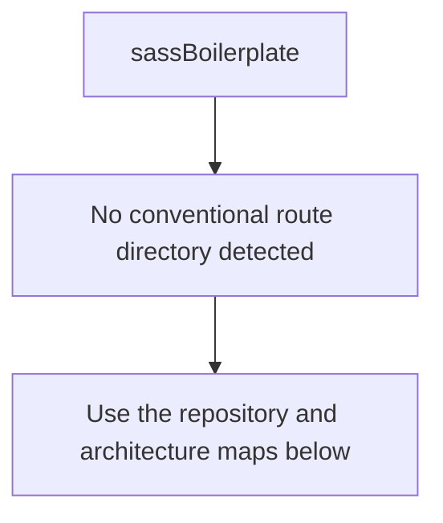
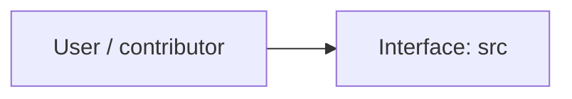
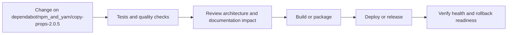
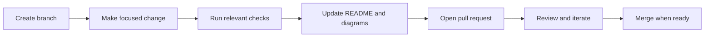

<!-- interactive-readme-standard:start -->

<div align="center">

# sassBoilerplate

**Branch-aware technical guide for [`dependabot/npm_and_yarn/copy-props-2.0.5`](https://github.com/Nischhalsubba/sassBoilerplate/tree/dependabot/npm_and_yarn/copy-props-2.0.5)**

<p>      </p>

<p>
  <a href="https://github.com/Nischhalsubba/sassBoilerplate/tree/dependabot/npm_and_yarn/copy-props-2.0.5"><strong>Browse source</strong></a> ·
  <a href="https://github.com/Nischhalsubba/sassBoilerplate/issues"><strong>Issues</strong></a> ·
  <a href="https://github.com/Nischhalsubba/sassBoilerplate/codespaces/new?ref=dependabot%2Fnpm_and_yarn%2Fcopy-props-2.0.5"><strong>Open in Codespaces</strong></a>
</p>

</div>

> [!IMPORTANT]
> This guide is generated from the files actually present on `dependabot/npm_and_yarn/copy-props-2.0.5`. It links to detected source paths, preserves project-authored notes, and avoids claiming components that were not found.

## At a glance

| Item | Detected value |
|---|---|
| Purpose | A simple Gulp 4 Starter Kit for modern web development. |
| Branch role | Compared with `master` |
| Stack | Sass, JavaScript, HTML, CSS |
| Manifests | package.json |
| Prerequisites | Node.js |
| Delivery | No conventional deployment configuration detected |
| License | LICENSE |

## Branch scope

This branch differs from the default branch in the following detected paths:

- [`README.md`](https://github.com/Nischhalsubba/sassBoilerplate/blob/dependabot/npm_and_yarn/copy-props-2.0.5/README.md)
- [`package-lock.json`](https://github.com/Nischhalsubba/sassBoilerplate/blob/dependabot/npm_and_yarn/copy-props-2.0.5/package-lock.json)

## Quick start

```bash
npm install
npm run start
npm run build
```

### Configuration surface

- No committed environment example file was detected.

> Never commit secrets, private keys, production credentials, customer data, or unredacted infrastructure details.

## Repository map



| Responsibility | Detected source paths |
|---|---|
| Interface | [`src`](https://github.com/Nischhalsubba/sassBoilerplate/tree/dependabot/npm_and_yarn/copy-props-2.0.5/src) |

## Website or application map



## Architecture and responsibility flow




## Quality, security, and operations

<table>
<tr>
<td width="33%" valign="top">

### Quality

- No conventional test directory was detected automatically.

Detected commands:
- `npm run start`
- `npm run build`

</td>
<td width="33%" valign="top">

### Security

- No dedicated security policy or automated dependency configuration was detected.

Review authentication, authorization, input validation, dependency updates, secret handling, and failure recovery before release.

</td>
<td width="34%" valign="top">

### Observability

- No dedicated observability integration was detected automatically.

Define useful logs, metrics, traces, alerts, and rollback signals for production-facing branches.

</td>
</tr>
</table>

## Delivery flow



### Automation detected

- No GitHub Actions workflow files were detected.

## Contribution flow



- Keep changes focused and explain architectural consequences.
- Run the checks relevant to the changed area.
- Update diagrams whenever routes, modules, data models, authentication, jobs, or delivery paths change.
- Add screenshots or recordings for visual behavior changes when useful.
- Use issues for reproducible defects and pull requests for reviewable changes.

## Ownership and support

| Topic | Source |
|---|---|
| Repository | [`Nischhalsubba/sassBoilerplate`](https://github.com/Nischhalsubba/sassBoilerplate) |
| Branch | [`dependabot/npm_and_yarn/copy-props-2.0.5`](https://github.com/Nischhalsubba/sassBoilerplate/tree/dependabot/npm_and_yarn/copy-props-2.0.5) |
| Ownership | No CODEOWNERS file detected |
| Contributing | Use the contribution flow above |
| Support | [Open or review issues](https://github.com/Nischhalsubba/sassBoilerplate/issues) |
| License | [`LICENSE`](https://github.com/Nischhalsubba/sassBoilerplate/blob/dependabot/npm_and_yarn/copy-props-2.0.5/LICENSE) |

<details>
<summary><strong>Documentation maintenance checklist</strong></summary>

- [ ] Purpose and branch scope are accurate.
- [ ] Setup and configuration commands still work.
- [ ] Repository, application, API, data, authentication, job, and deployment diagrams match the code.
- [ ] Tests, security controls, observability, and rollback behavior are documented.
- [ ] Links point to real files on this branch.
- [ ] No secrets or private operational details are exposed.

</details>

<!-- interactive-readme-standard:end -->

<!-- project-authored-notes:start -->
<details>
<summary><strong>Project-authored notes preserved from this branch</strong></summary>

# sassBoilerplate

[](https://www.npmjs.com/package/@jr-cologne/create-gulp-starter-kit)

> A simple sassBoilerplate for modern web development.

## Features / Use Cases
This Gulp Starter Kit provides a simple way of setting up a modern web development environment.
Here is a list of the current features:

- Copy HTML files from `src` to `dist` directory
- Compile Pug template files (`.pug`) from `src` to HTML files and put them inside `dist` directory
- Compile CSS preprocessor code (Sass/SCSS, Less, Stylus) to CSS
- Autoprefix and minify CSS and put it inside `dist` directory
- Compile ES6+ to ES5, concatenate JS files and minify code
- Compress and copy images into `dist` directory
- Copy dependencies specified in `package.json` from `src/node_modules` directory into `node_modules` folder inside `dist` directory
- Import dependencies into your application with ES6 modules
- Spin up local dev server at `http://localhost:3000` including auto-reloading

## Requirements
This should be installed on your computer in order to get up and running:

- [Node.js](https://nodejs.org/en/) (Required node version is >= 10.0)
- [Gulp 4](https://gulpjs.com/)

## Dependencies
These [npm](https://www.npmjs.com/) packages are used in the Gulp Starter Kit:

- [@babel/core](https://www.npmjs.com/package/@babel/core)
- [@babel/preset-env](https://www.npmjs.com/package/@babel/preset-env)
- [browser-sync](https://www.npmjs.com/package/browser-sync)
- [del](https://www.npmjs.com/package/del)
- [gulp](https://www.npmjs.com/package/gulp)
- [gulp-autoprefixer](https://www.npmjs.com/package/gulp-autoprefixer)
- [gulp-babel](https://www.npmjs.com/package/gulp-babel)
- [gulp-concat](https://www.npmjs.com/package/gulp-concat)
- [gulp-dependents](https://www.npmjs.com/package/gulp-dependents)
- [gulp-clean-css](https://www.npmjs.com/package/gulp-clean-css)
- [gulp-plumber](https://www.npmjs.com/package/gulp-plumber)
- [gulp-sass](https://www.npmjs.com/package/gulp-sass)
- [gulp-sourcemaps](https://www.npmjs.com/package/gulp-sourcemaps)
- [gulp-uglify](https://www.npmjs.com/package/gulp-uglify)
- [gulp-imagemin](https://www.npmjs.com/package/gulp-imagemin)
- [webpack-stream](https://www.npmjs.com/package/webpack-stream)
- [gulp-pug](https://www.npmjs.com/package/gulp-pug)
- [gulp-less](https://www.npmjs.com/package/gulp-less)
- [gulp-stylus](https://www.npmjs.com/package/gulp-stylus)

For more information, take a look at the [package.json](package.json) file or visit the linked npm package sites.

## Getting Started
In order to get started, make sure you are meeting all requirements listed above.
Then, just go ahead and download the Gulp Starter Kit. For this, you can choose between the following options:

### `npm init`
The recommended way of downloading the Gulp Starter Kit uses the command `npm init` and the [`create-gulp-starter-kit` npm package](https://www.npmjs.com/package/@jr-cologne/create-gulp-starter-kit) as the initializer.

For this, just follow these steps:

1. Execute `npm init @jr-cologne/gulp-starter-kit your-project-name`. This creates a folder called `your-project-name` (change that to your project name) at the current location where your terminal / command prompt is pointing to. Moreover, this initializes your project and installs all dependencies.
2. Change your working directory to your project folder by executing `cd your-project-name`.
3. Spin up your web development environment with the command `npm start`.
4. Start coding!

In case you are lazy, just use this command:

```bash
npm init @jr-cologne/gulp-starter-kit your-project-name && cd your-project-name && npm start
```

### `git clone`
The other way of downloading the Gulp Starter Kit is by cloning this Git repository. Before executing any commands, make sure you have [Git](https://git-scm.com/) installed on your computer.

Then, follow these instructions:

1. Execute `git clone https://github.com/jr-cologne/gulp-starter-kit.git your-project-name`. This creates a folder called `your-project-name` (change that to your project name) at the current location where your terminal / command prompt is pointing to.
2. Change your working directory to your project folder by executing `cd your-project-name`.
3. Install all dependencies by executing `npm install`.
4. Spin up your web development environment with the command `npm start`.
5. Start coding!

If you are lazy, just do everything at once:

```bash
git clone https://github.com/jr-cologne/gulp-starter-kit.git your-project-name && cd your-project-name && npm install && npm start
```

## Usage / FAQ
### How to install the Gulp Starter Kit into the current working directory?
You can install the Gulp Starter Kit into the current working directory by appending `--current-dir` to the end of the `npm init` command.

Example:
```bash
npm init @jr-cologne/gulp-starter-kit your-project-name --current-dir
```

### What kinds of build scripts does the Gulp Starter Kit offer?
The Gulp Starter Kit offers two different build scripts:

1. `npm run build`: This is used to build all files and run all tasks without serving a development server and watching for changes.
2. `npm start`: This is the normal development script used to build all files and run all tasks, but also to serve a development server and watch for changes.

### How can I use another CSS preprocessor than Sass?
In case you prefer to use one of the other supported CSS preprocessors over Sass, you can simply create a new directory `src/assets/css-processor-name` which is where all your CSS preprocessor files have to be placed.
After you have moved all your code to the new folder, just make sure to delete the `sass` directory and everything should work as expected.

Here's a list of the currently supported CSS preprocessors and the corresponding directory names:

- Sass (`src/assets/sass`)
- SCSS (`src/assets/scss`)
- Less (`src/assets/less`)
- Stylus (`src/assets/stylus`)

### How can I specify for which browsers CSS code should be autoprefixed?
The recommended way of specifying which browsers should be targeted by the CSS autoprefixer is to add a `browserslist` key to `package.json`:

```json
{
  "browserslist": [
    "last 3 versions",
    "> 0.5%"
  ]
}
```

You can find [more information on that topic](https://github.com/postcss/autoprefixer#browsers) in the README file of the employed [PostCSS plugin](https://github.com/postcss/autoprefixer).

### What types of images are supported?
The following types of images are currently supported:

- PNG
- JPG / JPEG
- GIF
- SVG
- ICO (not compressed)

### How can I specify dependencies which are then copied to the `dist` folder?
You don't need to specify your dependencies anywhere else than in your `package.json` file.
Just install your dependencies via npm and all your dependencies get automatically loaded and copied into the `dist` folder.

### How can I load dependencies inside my application?
ES6 modules are supported by this Gulp Starter Kit.
Just install your dependencies and import them like so:

```js
import axios from 'axios';
```

## Contributing
Feel free to contribute to this project!
Any kinds of contributions are highly appreciated!

Please make sure to **follow the process below** in order to contribute to this project:
1. **Open an Issue** to describe what you are about to do. You should make sure to get feedback as early as possile to ensure your work does not end up as waisted time.
2. **Fork this repository** by clicking the fork button at the top of this page.
3. Clone your newly created fork (`git clone https://github.com/your-github-username/gulp-starter-kit.git`).
4. Make your changes and commit them to your forked repository.
6. Once finished, **open a detailed Pull Request** describing your changes.
7. Wait for your PR to be accepted and merged.

## Versioning
This project uses the rules of semantic versioning. For more information, visit [semver.org](https://semver.org/).

## License
This project is licensed under the [MIT License](https://github.com/jr-cologne/gulp-starter-kit/blob/master/LICENSE).

</details>
<!-- project-authored-notes:end -->
