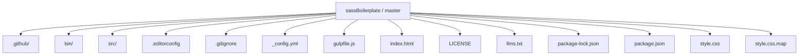
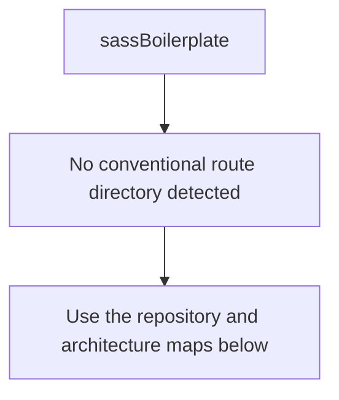
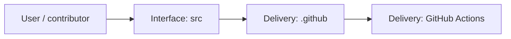
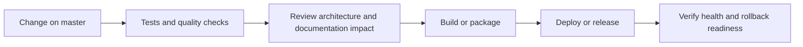
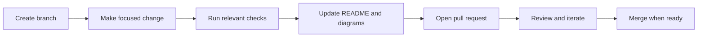

<!-- interactive-readme-standard:start -->

<div align="center">

# sassBoilerplate

**Branch-aware technical guide for [`master`](https://github.com/Nischhalsubba/sassBoilerplate/tree/master)**

<p>      </p>

<p>
  <a href="https://github.com/Nischhalsubba/sassBoilerplate/tree/master"><strong>Browse source</strong></a> ·
  <a href="https://github.com/Nischhalsubba/sassBoilerplate/issues"><strong>Issues</strong></a> ·
  <a href="https://github.com/Nischhalsubba/sassBoilerplate/codespaces/new?ref=master"><strong>Open in Codespaces</strong></a>
</p>

</div>

> [!IMPORTANT]
> This guide is generated from the files actually present on `master`. It links to detected source paths, preserves project-authored notes, and avoids claiming components that were not found.

## At a glance

| Item | Detected value |
|---|---|
| Purpose | A simple Gulp 4 Starter Kit for modern web development. |
| Branch role | Default branch |
| Stack | Sass, JavaScript, HTML, CSS |
| Manifests | package.json |
| Prerequisites | Node.js |
| Delivery | GitHub Actions |
| License | LICENSE |

## Branch scope

This is the repository's default branch.


## Quick start

```bash
npm install
npm run start
npm run build
```

### Configuration surface

- No committed environment example file was detected.

> Never commit secrets, private keys, production credentials, customer data, or unredacted infrastructure details.

## Repository map



| Responsibility | Detected source paths |
|---|---|
| Interface | [`src`](https://github.com/Nischhalsubba/sassBoilerplate/tree/master/src) |
| Delivery | [`.github`](https://github.com/Nischhalsubba/sassBoilerplate/tree/master/.github) |

## Website or application map



## Architecture and responsibility flow




## Quality, security, and operations

<table>
<tr>
<td width="33%" valign="top">

### Quality

- No conventional test directory was detected automatically.

Detected commands:
- `npm run start`
- `npm run build`

</td>
<td width="33%" valign="top">

### Security

- No dedicated security policy or automated dependency configuration was detected.

Review authentication, authorization, input validation, dependency updates, secret handling, and failure recovery before release.

</td>
<td width="34%" valign="top">

### Observability

- No dedicated observability integration was detected automatically.

Define useful logs, metrics, traces, alerts, and rollback signals for production-facing branches.

</td>
</tr>
</table>

## Delivery flow



### Automation detected

- [`.github/workflows/apply-interactive-readme.yml`](https://github.com/Nischhalsubba/sassBoilerplate/blob/master/.github/workflows/apply-interactive-readme.yml)

## Contribution flow



- Keep changes focused and explain architectural consequences.
- Run the checks relevant to the changed area.
- Update diagrams whenever routes, modules, data models, authentication, jobs, or delivery paths change.
- Add screenshots or recordings for visual behavior changes when useful.
- Use issues for reproducible defects and pull requests for reviewable changes.

## Ownership and support

| Topic | Source |
|---|---|
| Repository | [`Nischhalsubba/sassBoilerplate`](https://github.com/Nischhalsubba/sassBoilerplate) |
| Branch | [`master`](https://github.com/Nischhalsubba/sassBoilerplate/tree/master) |
| Ownership | No CODEOWNERS file detected |
| Contributing | Use the contribution flow above |
| Support | [Open or review issues](https://github.com/Nischhalsubba/sassBoilerplate/issues) |
| License | [`LICENSE`](https://github.com/Nischhalsubba/sassBoilerplate/blob/master/LICENSE) |

<details>
<summary><strong>Documentation maintenance checklist</strong></summary>

- [ ] Purpose and branch scope are accurate.
- [ ] Setup and configuration commands still work.
- [ ] Repository, application, API, data, authentication, job, and deployment diagrams match the code.
- [ ] Tests, security controls, observability, and rollback behavior are documented.
- [ ] Links point to real files on this branch.
- [ ] No secrets or private operational details are exposed.

</details>

<!-- interactive-readme-standard:end -->

<!-- project-authored-notes:start -->
<details>
<summary><strong>Project-authored notes preserved from this branch</strong></summary>

# sassBoilerplate

A historical copy of the **JR Cologne Gulp Starter Kit** used for learning and experimenting with Sass, Pug, Babel, BrowserSync, image optimization, and Gulp 4 workflows.

## Important status

This repository is not the canonical source of the starter kit and should not be presented as an independently maintained npm package.

The package metadata identifies the upstream project as:

- Package: `@jr-cologne/create-gulp-starter-kit`
- Original author: JR Cologne
- Original repository: https://github.com/jr-cologne/gulp-starter-kit
- License: MIT

Use the original project and its current documentation when you need authoritative installation, issue tracking, releases, or licensing information.

## What the archived workflow includes

- Gulp 4 task automation
- Sass, SCSS, Less, and Stylus compilation
- Pug template compilation
- Babel-based JavaScript transpilation
- JavaScript concatenation and minification
- BrowserSync development server
- CSS autoprefixing and minification
- image optimization
- sourcemaps
- dependency and asset copying

## Historical requirements

The package declares Node.js 10 or newer, but several dependencies and build assumptions are now old. Modern Node.js versions may expose incompatibilities, especially around:

- `gulp-sass` 4 and its native Sass implementation
- older image-minification packages
- deprecated dependency versions
- older Babel and webpack-stream behavior

Do not assume the project builds on a current runtime without testing and dependency migration.

## Run the archived version

```bash
npm install
npm start
```

Build without the development server:

```bash
npm run build
```

These commands describe the historical package scripts, not a guarantee of compatibility with modern Node.js.

## Recommended modern direction

For new static projects, consider:

- Dart Sass instead of deprecated native Sass bindings
- Vite or another supported build tool
- PostCSS and Autoprefixer
- native ES modules
- modern image pipelines
- explicit linting and formatting

## Repository purpose

This copy is retained as a learning archive showing an earlier static-site automation workflow. It should not be published to npm under the upstream package name or used to report issues to the original project without first reproducing them against the canonical repository.

</details>
<!-- project-authored-notes:end -->
